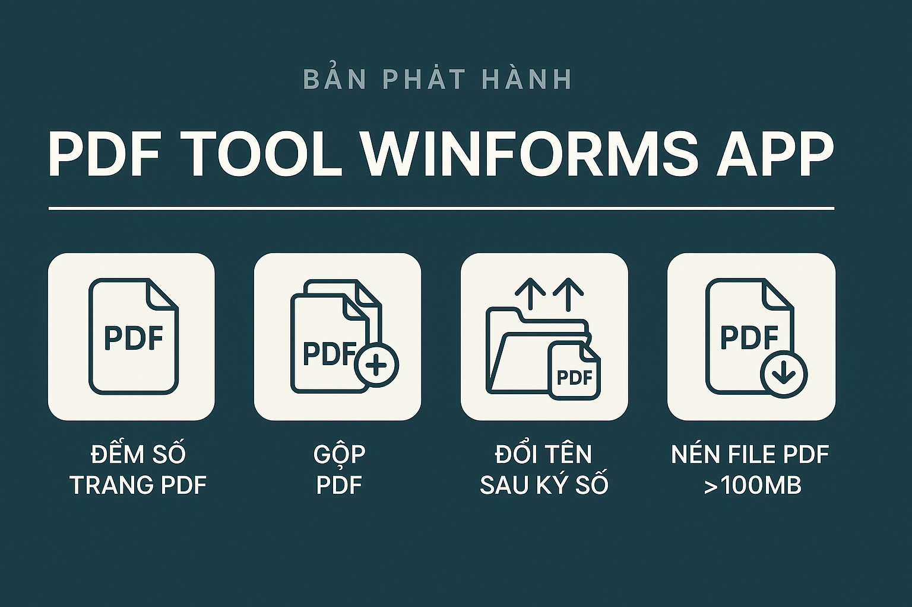

# 📦 PDF Tool WinForms App

---

## 🗂 Thông tin phần mềm
- **Tên**: PDF Tool WinForms App
- **Phiên bản**: 1.0.0
- **Tác giả**: @giangcse
- **Hỗ trợ**: Windows (WinForms)
- **Ngày phát hành**: 2025-06-08

---

## ✨ Các chức năng chính

✅ **1. Đếm số trang PDF**  
- Quét toàn bộ file PDF trong thư mục (bao gồm thư mục con).  
- Xuất file Excel: `Result.xlsx` với thông tin: đường dẫn, tên file, số trang, khổ giấy (A0 – A4).

✅ **2. Gộp PDF**  
- Tự động tìm thư mục chứa file PDF.  
- Gộp toàn bộ file PDF thành 1 file duy nhất: `FileTong.pdf`.

✅ **3. Đổi tên sau ký số**  
- Tìm thư mục `Unknown` trong các thư mục `HOP SO XX R`.  
- Di chuyển file PDF vào thư mục prefix (theo định dạng `001-02-0001-xx`).  
- Di chuyển các thư mục con ra ngoài, xóa thư mục `Unknown`.

✅ **4. Nén file PDF >100MB**  
- Quét toàn bộ file PDF trong thư mục.  
- File >100MB sẽ được nén (dùng Ghostscript, chất lượng tốt /ebook).  
- Ghi đè file PDF cũ sau khi nén.  
- Xuất danh sách file lớn ra file Excel: `CompressedFiles.xlsx`.

---

## 🛠 Yêu cầu hệ thống
- **Hệ điều hành**: Windows 10/11 (64-bit)
- **.NET Framework**: 4.8 trở lên
- **Ghostscript**: Cài sẵn, ví dụ: `C:\Program Files\gs\gs10.03.0\bin\gswin64c.exe`

---

## 🚀 Hướng dẫn sử dụng
1️⃣ Mở app **PDF Tool WinForms App**  
2️⃣ Chọn **thư mục gốc** (có thể là `E:\SOHOA\KHOA_7` – chứa nhiều `HOP SO XX R`).  
3️⃣ Chọn **chức năng** (1 trong 4 chức năng).  
4️⃣ Nhấn **Chạy**.  
5️⃣ Theo dõi log hiển thị tiến trình.

👉 Kết quả: file Excel (`Result.xlsx` hoặc `CompressedFiles.xlsx`) và file `FileTong.pdf` sẽ được xuất ngay trong thư mục.

---

## 🐞 Các vấn đề đã khắc phục
- Logic di chuyển file/folder trong thư mục `Unknown`.  
- Chỉ xóa đúng thư mục `Unknown`, không ảnh hưởng thư mục cha.  
- Nén PDF với Ghostscript chỉ giảm dung lượng vừa đủ, đảm bảo chất lượng.

---

## 📦 Đính kèm
- `PdfToolWinFormsApp.exe`  
- `Result.xlsx` (nếu đếm trang PDF)  
- `FileTong.pdf` (nếu gộp PDF)  
- `CompressedFiles.xlsx` (nếu nén file PDF lớn)  
- `banner.png`

---

🎉 Chúc bạn sử dụng thành công!  
**Mọi vấn đề hoặc yêu cầu hỗ trợ** → Liên hệ [giangpt@duck.com].
